# 💫 About Me:
```json
{
  "name"      : "Anwar Azarzou",
  "role"      : "Full-Stack Developer",
  "location"  : "Casablanca, Morocco",
  "stack"     : ["Laravel", "React", "Tailwind CSS", "MySQL", "C", "Linux"],
  "status"    : "Building in public. Locked in.",
  "open_to"   : ["Freelance", "Collaborations", "Open Source"],
  "philosophy": "Good software is invisible — users shouldn't think about it."
}
```

## 🌐 Socials:
[](https://www.linkedin.com/in/anwar-azarzou-20b923271)
[](mailto:anwar.azarzou@gmail.com)
[](https://portfolio-eight-pied-79.vercel.app/)
[](https://github.com/Anwaroxxx)

# 💻 Tech Stack:


# 📊 GitHub Stats:
<br/>
<br/>


# 📈 Activity Graph:


### 🔝 Top Contributed Repo


---
[](https://visitcount.itsvg.in)

<!-- Proudly created with GPRM ( https://gprm.itsvg.in ) -->
